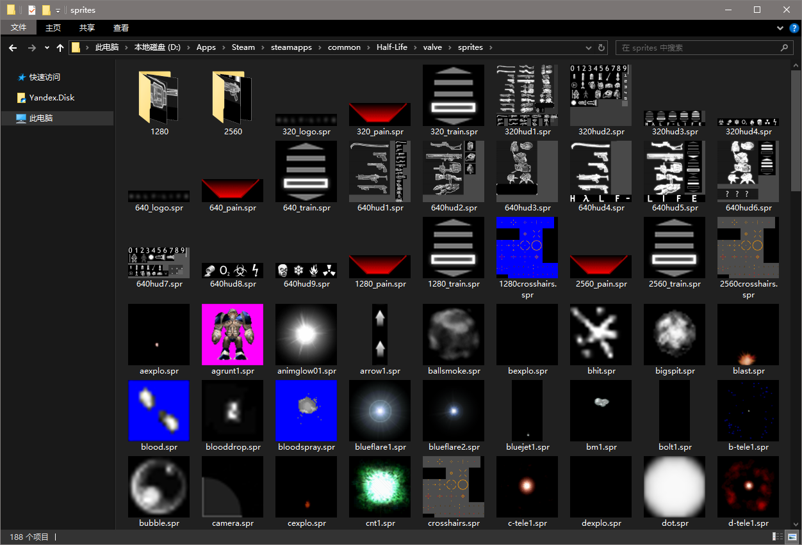

# GoldSrc Model Thumbnail Provider

A Windows Explorer extension that displays thumbnails of Half-Life's sprite files in Windows Explorer.

## Preview



## Install

Run with administrator privileges

```
regsvr32 GoldSrcSpriteThumbnailProvider64.dll
```

## Uninstall

Run with administrator privileges

```
regsvr32 /u GoldSrcSpriteThumbnailProvider64.dll
```

Reboot the OS

